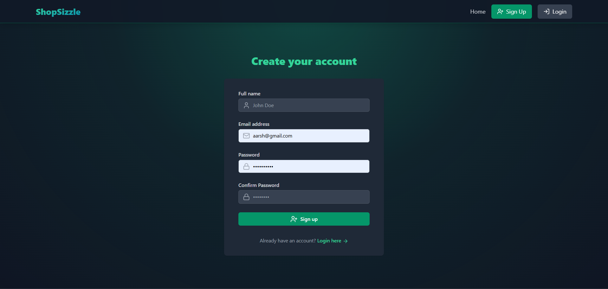
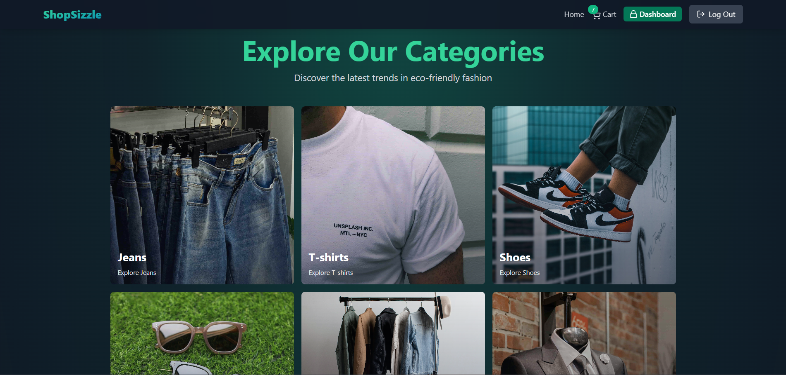
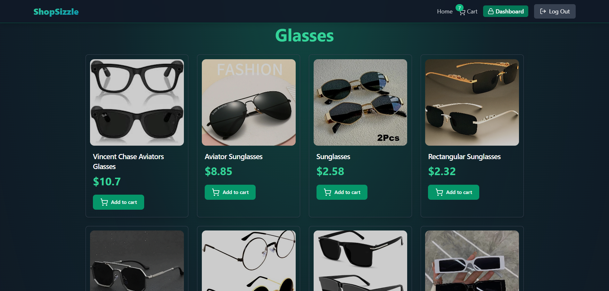
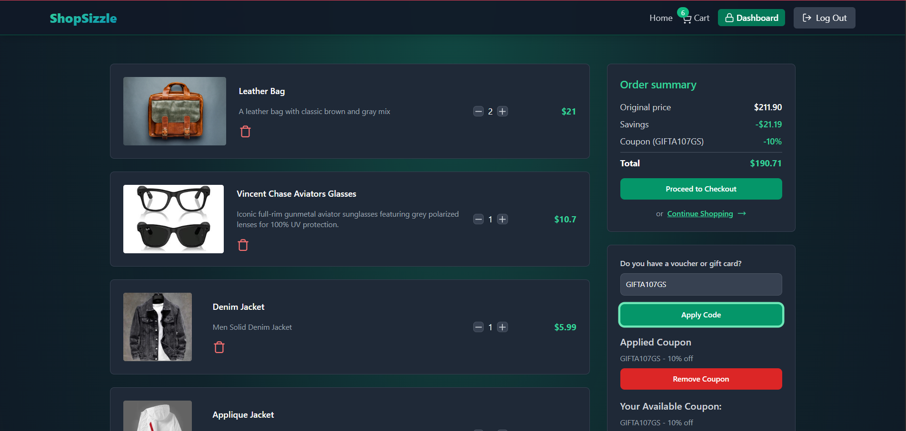
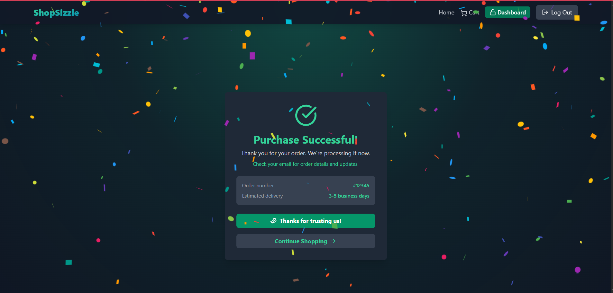

# 🚀 ShopSizzle — Full-Stack E-Commerce Platform


- Built a production-oriented full-stack e-commerce platform using the MERN stack  
- Implemented end-to-end shopping workflows including product discovery, cart management, and checkout  
- Integrated secure payment processing with Stripe to simulate real-world transaction flows  
- Developed a dynamic coupon system with validation, discount application, and edge-case handling  
- Designed admin-driven operations for product management and store analytics  
- Focused on scalable architecture and real-world system design beyond basic CRUD applications  

------------------------------------------------------------------------

## 🌐 Live Demo

https://aarsh-shopsizzle.onrender.com/

------------------------------------------------------------------------

## ✨ Why This Project Stands Out

-   End-to-end e-commerce workflow (browse → cart → checkout → order)
-   Stripe payment integration with backend verification
-   Redis caching for performance and session handling
-   Full-stack ownership (UI → API → DB → payment layer)
-   Handles real-world edge cases (cart sync, coupons, payments)

------------------------------------------------------------------------

## 🧠 Core Features

### 🔐 Authentication & Session Management

-   JWT-based authentication (access + refresh tokens)
-   HTTP-only cookies for security
-   Redis-backed session persistence
-   Role-based route protection

### 🛍️ Product Discovery

-   Featured products, categories, recommendations
-   Optimized queries with caching
-   Cloudinary-based image handling

### 🛒 Cart System

-   Add/remove/update items
-   Real-time total calculation
-   Persistent cart state
-   Edge case handling (duplicates, invalid qty)

### 💳 Payment & Orders

-   Stripe Checkout integration
-   Backend payment validation
-   Order creation after successful payment

### 🎟️ Coupons

-   Dynamic coupon generation
-   Validation and application logic
-   Real-time discount updates

### 📊 Admin Dashboard

-   Product management (CRUD)
-   Featured product toggling
-   Revenue and sales analytics
-   Data visualization with charts

------------------------------------------------------------------------

## 🛠️ Tech Stack

### Frontend

React, Vite, Tailwind CSS, Zustand, React Router, Axios, Framer Motion,
Recharts, Stripe.js

### Backend

Node.js, Express, MongoDB, Mongoose, Redis, JWT, Stripe API, Cloudinary

------------------------------------------------------------------------

## 📸 Screenshots

### 🔐 Authentication (Sign Up)
<p align="center">
  
</p>

> Secure user registration with form validation, password confirmation, and protected authentication flow.

---

### 🏠 Product Categories
<p align="center">
  
</p>

> Explore products by categories with a clean UI and intuitive navigation for better discovery.

---

### 🛍️ Product Listing
<p align="center">
  
</p>

> Browse products with pricing, images, and quick add-to-cart functionality.

---

### 🛒 Cart & Coupon System
<p align="center">
  
</p>

> Manage cart items, update quantities, and apply coupons with real-time price calculation and discount handling.

---

### ✅ Checkout Success
<p align="center">
  
</p>

> Order confirmation page after successful Stripe payment with order details and delivery estimation.

------------------------------------------------------------------------

## 🏗️ Architecture

Client → API → Express → Controllers → MongoDB → Redis →
Stripe/Cloudinary

------------------------------------------------------------------------

## ⚡ Challenges & Learnings

-   Cart state synchronization across sessions
-   Secure Stripe payment flow handling
-   JWT auth with refresh tokens and Redis
-   Performance optimization using caching
-   Handling real-world edge cases

------------------------------------------------------------------------

## 🚧 Future Improvements

-   Inventory management system
-   Search, filters, pagination
-   Wishlist feature
-   Stripe webhooks
-   Order tracking UI

------------------------------------------------------------------------

## 📦 Project Structure

```text
ShopSizzle/
├── backend/
│   ├── controllers/
│   ├── models/
│   ├── routes/
│   ├── middleware/
│   ├── lib/
│   └── server.js
│
├── frontend/
│   ├── src/
│   │   ├── components/
│   │   ├── pages/
│   │   ├── stores/
│   │   ├── lib/
│   │   └── App.jsx
│
└── README.md
```

------------------------------------------------------------------------

## 🎯 Recruiter Snapshot

- Built a production-grade e-commerce platform with real payment integration  
- Demonstrated full-stack ownership across UI, backend, database, and third-party services  
- Implemented real-world features like coupon system, caching, and secure authentication  
- Focused on scalability, performance, and production-ready architecture  

------------------------------------------------------------------------
